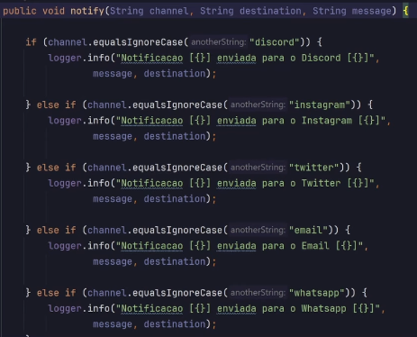
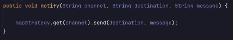

# About

Brief study about Design Pattern Strategy with Java.

# How does it work?

Basically, we can define a common interface for a group of "behaviors" that are related.

Each implementation from this interface will represent a "strategy", and the client can choose which strategy to use.

In this study we are going to see the implementation of this strategy in an if-else code, but that's not the unique
use of this pattern, check it out:

## Where strategy is useful beyond if-else?

Here are some situations:

### Configurable systems

When we need to offer different ways to execute an action, like: 

1. Calculate discounts;
2. Process payment;
3. Determine some validation policy.

Put some code with example.

### Polymorphism behavior

When different objects of a hierarchy needs to implement similar behaviors with variations (WITHOUT USING HIERARCHY).

(Write more).

Put some code with example.

### Modular processing

When different steps of the processing can be altered or combined dynamically.

(Write more).

Put some code with example.

### Complex conditional logic

Replace if-else, making it easier to add new conditions without the need to change the existent code.

(Write more).

Put some code with example.

### Testability

Making it easier for unitary tests, isolating and testing each behavior individually

(Write more).

Put some code with example.

# If-else (service) - example

This, is going to become this:

[Refactoring Guru Strategy Java](https://refactoring.guru/pt-br/design-patterns/strategy/java/example)

## Identifying the problem (Patterns)

The first thing we need to see to know if we need to use this pattern, is if we have a lot of conditionals and depending
on the outcomes, the result are the same.

For example: we need to make a payment, right? If we are going to use a credit card is one system, a debit card is another 
one, pix other service as well.

The implementation of each payment WILL BE different but the purpose is the same, MAKE A PAYMENT.

In our example is a similar concept, we are going to send a notification to different social networks.

So, lets begin!

## Creating the interface

3:37

